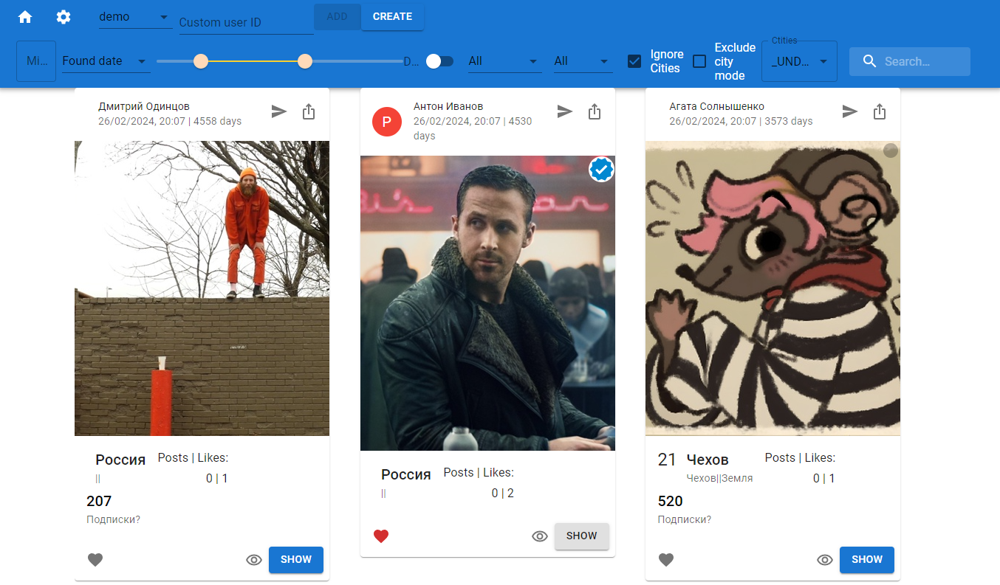

# vk.com Activity Scraper

This is a Flask-based web server designed to scrape a user's activity from VK.com. It utilizes MongoDB for storing and indexing user data. This application is capable of producing real-time data reflecting the activities within VK.com groups.

## Demo

http://bot.raveninn.cloud/

THIS IS A DEMO INSTANCE. PLEASE DO NOT ABUSE THE SERVER.

GIT REPOSITORY IS DEGRADED AND DOESN'T WORK LOCALLY.

## Features

- Flask-based web server for handling requests and responses.
- Utilizes MongoDB for efficient data storage and indexing.
- Real-time data analysis of VK.com group activities.
- Full text search capabilities for user data.
- Manually add users from other sources.

## License

This project is licensed under the MIT License - see the LICENSE file for details.
